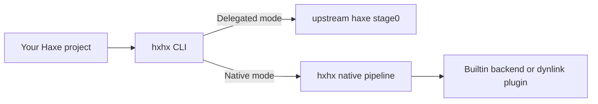

# Execution Modes: Delegated vs Native

This project uses two execution modes.

- **Delegated mode**: `hxhx` forwards compile work to upstream `haxe` (`stage0`).
- **Native mode**: `hxhx` runs its own compile pipeline/backends directly.

If you are new, this is the most important distinction.

## Mental model

## When to use each mode

| Mode | Use it when | Strength | Tradeoff |
| --- | --- | --- | --- |
| Delegated | You need compatibility-first behavior right now | Predictable baseline via upstream `haxe` | Depends on stage0 |
| Native | You are validating or shipping non-delegating `hxhx` paths | Future-ready architecture, native plugin/builtin paths | Some lanes are still maturing |

## Portable vs metal (profile summary)

| Profile | Goal | Typical use | Tradeoff |
| --- | --- | --- | --- |
| `portable` | Compatibility-first semantics | Default builds and cross-target-friendly code paths | Can carry more runtime overhead |
| `metal` | Native-leaning strict mode | Performance-focused, metal-safe code paths | Stricter constraints and fail-fast checks |

Deep contract details:
- `docs/02-user-guide/OCAML_PROFILE_CONTRACT.md`
- `docs/02-user-guide/OCAML_RUNTIME_CAPABILITY_MATRIX.md`

## Related terms

- `stage0`, `stage3`, `stage4` are contributor architecture terms.
- Beginner docs should prefer **delegated** and **native** terms first.

See `docs/00-project/GLOSSARY.md` for term definitions.
