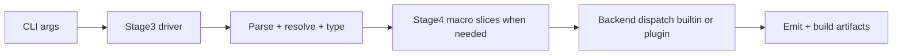

# Native Mode Pipeline (Stage3 + Stage4 Slices)

This page resolves a common confusion:

- Stage3 docs describe the **typer component**.
- Stage4 docs describe **macro/plugin execution**.
- A real native compile run can include both.

## End-to-end native flow

## What runs where

| Slice | Owns | Does not own |
| --- | --- | --- |
| Stage3 typer component | parse/resolve/type pipeline and backend dispatch orchestration | macro runtime semantics |
| Stage4 macro/plugin component | macro execution, macro-host protocol, plugin ABI slices | core parse/resolve/type implementation |

## Why this split exists

- Keeps the typer architecture testable and incremental.
- Lets macro/runtime evolution happen behind a contract boundary.
- Avoids coupling all native progress to full macro parity.

## Related docs

- `docs/02-user-guide/HXHX_STAGE3_TYPING.md`
- `docs/02-user-guide/HXHX_STAGE4_MACROS_AND_PLUGIN_ABI.md`
- `docs/02-user-guide/concepts/execution_modes.md`
